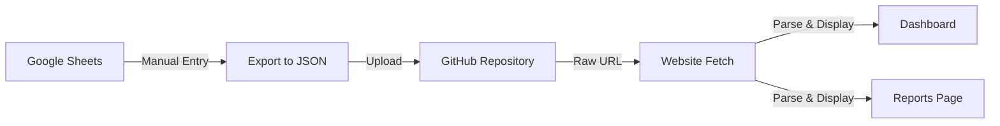

# 📊 MAMTJ6 Infaq Center - Data Structure Documentation

> Complete guide for data management and Google Sheets integration

---

## 📋 Table of Contents

- [Overview](#-overview)
- [JSON Data Schema](#-json-data-schema)
- [Google Sheets Template](#-google-sheets-template)
- [Data Fields Explained](#-data-fields-explained)
- [Update Workflow](#-update-workflow)
- [Data Validation](#-data-validation)
- [Troubleshooting](#-troubleshooting)

---

## 🎯 Overview

### Data Flow Architecture



### Current Setup

- **Data Source**: Google Sheets (manually maintained)
- **Export Format**: JSON
- **Hosting**: GitHub (raw file URL)
- **Update Frequency**: Manual (as needed)
- **Cache Duration**: 5 minutes (browser auto-refresh)

### Data URL

```javascript
const jsonDataUrl = "https://raw.githubusercontent.com/multimedia-mamtj6/infaq/main/data/data.json";
```

---

## 📝 JSON Data Schema

### Complete Structure

```json
{
  "projek": {
    "NamaProjek": "string",
    "SasaranKutipan": number,
    "JumlahTerkumpul": number,
    "Peratusan": number
  },
  "ringkasan": {
    "kutipan": {
      "bulanIni": {
        "bulan": "string",
        "jumlah": number
      },
      "bulanLepas": {
        "bulan": "string",
        "jumlah": number
      },
      "tahunIni": {
        "tahun": "string",
        "jumlah": number
      }
    }
  },
  "paparanBulanIni": {
    "Minggu1": number,
    "Minggu2": number,
    "Minggu3": number,
    "Minggu4": number,
    "Minggu5": number
  },
  "graf": {
    "2025": {
      "tahun": "2025",
      "labels": ["Jan", "Feb", "Mar", "Apr", "May", "Jun", "Jul", "Aug", "Sep", "Oct", "Nov", "Dec"],
      "data": [number, number, number, ...]
    },
    "2024": {
      "tahun": "2024",
      "labels": ["Jan", "Feb", "Mar", ...],
      "data": [number, number, number, ...]
    }
  },
  "tarikhKemaskini": "ISO 8601 date string"
}
```

### Example Data

```json
{
  "projek": {
    "NamaProjek": "Pembinaan Dewan Serbaguna MAMTJ6",
    "SasaranKutipan": 500000,
    "JumlahTerkumpul": 325750.50,
    "Peratusan": 65
  },
  "ringkasan": {
    "kutipan": {
      "bulanIni": {
        "bulan": "November 2024",
        "jumlah": 15230.00
      },
      "bulanLepas": {
        "bulan": "Oktober 2024",
        "jumlah": 12450.50
      },
      "tahunIni": {
        "tahun": "2024",
        "jumlah": 145680.75
      }
    }
  },
  "paparanBulanIni": {
    "Minggu1": 3250.00,
    "Minggu2": 4120.50,
    "Minggu3": 3890.00,
    "Minggu4": 3969.50,
    "Minggu5": 0
  },
  "graf": {
    "2025": {
      "tahun": "2025",
      "labels": ["Jan", "Feb", "Mar", "Apr", "May", "Jun", "Jul", "Aug", "Sep", "Oct", "Nov", "Dec"],
      "data": [0, 0, 0, 0, 0, 0, 0, 0, 0, 0, 0, 0]
    },
    "2024": {
      "tahun": "2024",
      "labels": ["Jan", "Feb", "Mar", "Apr", "May", "Jun", "Jul", "Aug", "Sep", "Oct", "Nov", "Dec"],
      "data": [8500, 9200, 11300, 10800, 12500, 13200, 14100, 13800, 15200, 12450, 15230, 0]
    }
  },
  "tarikhKemaskini": "2024-11-26T14:30:00+08:00"
}
```

---

## 📊 Google Sheets Template

### Sheet Structure

Create a Google Sheet with the following structure:

#### Sheet 1: "Projek Utama"

| Field | Value | Type | Example |
|-------|-------|------|---------|
| Nama Projek | Text | String | Pembinaan Dewan Serbaguna MAMTJ6 |
| Sasaran Kutipan | Number | Number | 500000 |
| Jumlah Terkumpul | Number | Number | 325750.50 |
| Peratusan | Number | Number | 65 |

#### Sheet 2: "Ringkasan Kutipan"

| Period | Label | Amount |
|--------|-------|--------|
| Bulan Ini | November 2024 | 15230.00 |
| Bulan Lepas | Oktober 2024 | 12450.50 |
| Tahun Ini | 2024 | 145680.75 |

#### Sheet 3: "Kutipan Mingguan"

| Week | Amount |
|------|--------|
| Minggu 1 | 3250.00 |
| Minggu 2 | 4120.50 |
| Minggu 3 | 3890.00 |
| Minggu 4 | 3969.50 |
| Minggu 5 | 0 |

> **Note**: Minggu 5 is optional (for months with 5 weeks). Set to 0 if not applicable.

#### Sheet 4: "Graf Tahunan 2024"

| Month | Amount |
|-------|--------|
| Jan | 8500 |
| Feb | 9200 |
| Mar | 11300 |
| Apr | 10800 |
| May | 12500 |
| Jun | 13200 |
| Jul | 14100 |
| Aug | 13800 |
| Sep | 15200 |
| Oct | 12450 |
| Nov | 15230 |
| Dec | 0 |

#### Sheet 5: "Graf Tahunan 2025"

| Month | Amount |
|-------|--------|
| Jan | 0 |
| Feb | 0 |
| ... | ... |
| Dec | 0 |

### Google Sheets Formula Examples

**Calculate Percentage:**
```excel
=ROUND((B2/B1)*100, 0)
```
Where:
- B1 = Sasaran Kutipan
- B2 = Jumlah Terkumpul

**Sum Weekly Collections:**
```excel
=SUM(B2:B6)
```
Where B2:B6 are Minggu1 to Minggu5

**Current Date/Time:**
```excel
=NOW()
```

### Download Template

📥 **[Download Google Sheets Template](https://docs.google.com/spreadsheets/d/YOUR_TEMPLATE_ID/copy)**

---

## 📖 Data Fields Explained

### 1. `projek` Object

Main project information displayed on the dashboard.

| Field | Type | Description | Required | Example |
|-------|------|-------------|----------|---------|
| `NamaProjek` | String | Name of current project | ✅ Yes | "Pembinaan Dewan Serbaguna MAMTJ6" |
| `SasaranKutipan` | Number | Target collection amount (RM) | ✅ Yes | 500000 |
| `JumlahTerkumpul` | Number | Current collected amount (RM) | ✅ Yes | 325750.50 |
| `Peratusan` | Number | Percentage achieved (0-100) | ✅ Yes | 65 |

**Validation Rules:**
- `Peratusan` should be calculated as: `(JumlahTerkumpul / SasaranKutipan) * 100`
- All numbers should be positive
- `Peratusan` should not exceed 100 (unless over-target)

---

### 2. `ringkasan.kutipan` Object

Summary statistics for different time periods.

#### `bulanIni` (Current Month)

| Field | Type | Description | Example |
|-------|------|-------------|---------|
| `bulan` | String | Month name and year | "November 2024" |
| `jumlah` | Number | Total collected this month | 15230.00 |

#### `bulanLepas` (Last Month)

| Field | Type | Description | Example |
|-------|------|-------------|---------|
| `bulan` | String | Month name and year | "Oktober 2024" |
| `jumlah` | Number | Total collected last month | 12450.50 |

#### `tahunIni` (Current Year)

| Field | Type | Description | Example |
|-------|------|-------------|---------|
| `tahun` | String | Year | "2024" |
| `jumlah` | Number | Total collected this year | 145680.75 |

**Validation Rules:**
- Month names should be in Malay (Januari, Februari, Mac, etc.)
- `tahunIni.jumlah` should equal sum of all months in `graf` for that year
- `bulanIni.jumlah` should equal sum of all weeks in `paparanBulanIni`

---

### 3. `paparanBulanIni` Object

Weekly breakdown for the current month.

| Field | Type | Description | Range |
|-------|------|-------------|-------|
| `Minggu1` | Number | Week 1 collection | ≥ 0 |
| `Minggu2` | Number | Week 2 collection | ≥ 0 |
| `Minggu3` | Number | Week 3 collection | ≥ 0 |
| `Minggu4` | Number | Week 4 collection | ≥ 0 |
| `Minggu5` | Number | Week 5 collection (optional) | ≥ 0 |

**Validation Rules:**
- All values must be ≥ 0
- Set `Minggu5` to 0 if month has only 4 weeks
- Sum should equal `ringkasan.kutipan.bulanIni.jumlah`

**Week Definition:**
- Week 1: Day 1-7
- Week 2: Day 8-14
- Week 3: Day 15-21
- Week 4: Day 22-28
- Week 5: Day 29-31 (if applicable)

---

### 4. `graf` Object

Yearly collection data for charts.

Each year is a separate object:

```json
"2024": {
  "tahun": "2024",
  "labels": ["Jan", "Feb", "Mar", "Apr", "May", "Jun", "Jul", "Aug", "Sep", "Oct", "Nov", "Dec"],
  "data": [8500, 9200, 11300, 10800, 12500, 13200, 14100, 13800, 15200, 12450, 15230, 0]
}
```

| Field | Type | Description | Required |
|-------|------|-------------|----------|
| `tahun` | String | Year | ✅ Yes |
| `labels` | Array[String] | Month abbreviations | ✅ Yes |
| `data` | Array[Number] | Monthly amounts | ✅ Yes |

**Validation Rules:**
- `labels` array must have exactly 12 elements
- `data` array must have exactly 12 elements
- Month abbreviations: Jan, Feb, Mar, Apr, May, Jun, Jul, Aug, Sep, Oct, Nov, Dec
- All amounts must be ≥ 0
- Future months should be 0

---

### 5. `tarikhKemaskini` Field

Last update timestamp in ISO 8601 format.

| Field | Type | Format | Example |
|-------|------|--------|---------|
| `tarikhKemaskini` | String | ISO 8601 | "2024-11-26T14:30:00+08:00" |

**Format:**
```
YYYY-MM-DDTHH:mm:ss+08:00
```

**Timezone:** Malaysia (UTC+8)

**JavaScript Generation:**
```javascript
new Date().toISOString()
// or
new Date().toLocaleString('sv-SE', { timeZone: 'Asia/Kuala_Lumpur' }).replace(' ', 'T') + '+08:00'
```

---

## 🔄 Update Workflow

### Step-by-Step Process

#### 1. Update Google Sheets

1. Open your Google Sheets
2. Navigate to appropriate sheet
3. Update the values:
   - **Daily**: Update weekly collections
   - **Monthly**: Update monthly summaries, add new month to yearly data
   - **Project**: Update project progress

#### 2. Validate Data

Run these checks before exporting:

- [ ] All numbers are positive
- [ ] Percentages are correct
- [ ] Weekly totals match monthly total
- [ ] Monthly totals match yearly total
- [ ] No missing fields
- [ ] Date format is correct

#### 3. Export to JSON

**Option A: Manual Export**

1. Use Google Apps Script:
   ```javascript
   function exportToJSON() {
     var sheet = SpreadsheetApp.getActiveSpreadsheet();
     var data = {
       projek: {
         NamaProjek: sheet.getRange("Projek!B1").getValue(),
         SasaranKutipan: sheet.getRange("Projek!B2").getValue(),
         JumlahTerkumpul: sheet.getRange("Projek!B3").getValue(),
         Peratusan: sheet.getRange("Projek!B4").getValue()
       },
       // ... rest of the structure
       tarikhKemaskini: new Date().toISOString()
     };
     
     Logger.log(JSON.stringify(data, null, 2));
   }
   ```

2. Copy the output
3. Validate JSON at [JSONLint](https://jsonlint.com/)

**Option B: Automated Script**

Create a Google Apps Script that:
- Reads data from sheets
- Formats as JSON
- Uploads to GitHub via API

#### 4. Upload to GitHub

1. Go to your GitHub repository
2. Navigate to `data/data.json`
3. Click "Edit" (pencil icon)
4. Paste the new JSON
5. Commit changes with message: "Update data - [Date]"

#### 5. Verify Update

1. Wait 1-2 minutes for GitHub to process
2. Open website
3. Check if data appears correctly
4. Verify timestamp shows recent update

### Update Frequency Recommendations

| Data Type | Frequency | Reason |
|-----------|-----------|--------|
| Weekly Collections | Daily | Keep donors informed |
| Monthly Summary | End of month | Accurate reporting |
| Yearly Data | Monthly | Trend analysis |
| Project Progress | Weekly | Maintain transparency |
| Timestamp | Every update | Track freshness |

---

## ✅ Data Validation

### Pre-Export Checklist

#### Mathematical Validation

```javascript
// Check if weekly sum equals monthly total
const weeklySum = Minggu1 + Minggu2 + Minggu3 + Minggu4 + Minggu5;
const monthlyTotal = ringkasan.kutipan.bulanIni.jumlah;
console.assert(weeklySum === monthlyTotal, "Weekly sum mismatch!");

// Check if percentage is correct
const calculatedPercentage = Math.round((projek.JumlahTerkumpul / projek.SasaranKutipan) * 100);
console.assert(calculatedPercentage === projek.Peratusan, "Percentage mismatch!");

// Check if yearly sum is correct
const yearlySum = graf["2024"].data.reduce((a, b) => a + b, 0);
console.assert(yearlySum === ringkasan.kutipan.tahunIni.jumlah, "Yearly sum mismatch!");
```

#### JSON Validation

**Online Tools:**
- [JSONLint](https://jsonlint.com/) - Validate JSON syntax
- [JSON Schema Validator](https://www.jsonschemavalidator.net/) - Validate against schema

**Command Line:**
```bash
# Using jq
cat data.json | jq empty

# Using Python
python -m json.tool data.json
```

#### Field Validation

| Field | Validation | Error Message |
|-------|------------|---------------|
| All numbers | `>= 0` | "Negative values not allowed" |
| Percentage | `0 <= x <= 100` | "Percentage must be 0-100" |
| Date | ISO 8601 format | "Invalid date format" |
| Arrays | Length = 12 | "Array must have 12 elements" |

### Automated Validation Script

```javascript
function validateData(data) {
  const errors = [];
  
  // Check required fields
  if (!data.projek || !data.ringkasan || !data.paparanBulanIni || !data.graf) {
    errors.push("Missing required top-level fields");
  }
  
  // Validate numbers
  if (data.projek.JumlahTerkumpul < 0) {
    errors.push("JumlahTerkumpul cannot be negative");
  }
  
  // Validate percentage
  const calcPercentage = Math.round((data.projek.JumlahTerkumpul / data.projek.SasaranKutipan) * 100);
  if (calcPercentage !== data.projek.Peratusan) {
    errors.push(`Percentage mismatch: expected ${calcPercentage}, got ${data.projek.Peratusan}`);
  }
  
  // Validate weekly sum
  const weeklySum = Object.values(data.paparanBulanIni).reduce((a, b) => a + b, 0);
  if (weeklySum !== data.ringkasan.kutipan.bulanIni.jumlah) {
    errors.push(`Weekly sum (${weeklySum}) doesn't match monthly total (${data.ringkasan.kutipan.bulanIni.jumlah})`);
  }
  
  // Validate date format
  if (!/^\d{4}-\d{2}-\d{2}T\d{2}:\d{2}:\d{2}/.test(data.tarikhKemaskini)) {
    errors.push("Invalid date format");
  }
  
  return errors;
}

// Usage
const errors = validateData(jsonData);
if (errors.length > 0) {
  console.error("Validation errors:", errors);
} else {
  console.log("✅ Data is valid!");
}
```

---

## 🔧 Troubleshooting

### Common Issues

#### Issue 1: Data Not Updating on Website

**Symptoms:**
- Old data still showing
- Timestamp not changing

**Solutions:**
1. **Clear browser cache**
   - Press `Ctrl + Shift + R` (Windows)
   - Press `Cmd + Shift + R` (Mac)

2. **Check GitHub raw URL**
   - Ensure URL is correct
   - Try accessing URL directly in browser
   - GitHub may cache for up to 5 minutes

3. **Verify JSON is valid**
   - Check for syntax errors
   - Use JSONLint to validate

4. **Check console for errors**
   - Open browser DevTools (F12)
   - Look for fetch errors
   - Check CORS issues

#### Issue 2: Numbers Not Displaying Correctly

**Symptoms:**
- Shows "RM 0.00" or "NaN"
- Percentage shows 0%

**Solutions:**
1. **Check data types**
   - Ensure numbers are not strings
   - Remove commas from numbers in JSON
   - Example: `15000` not `"15,000"`

2. **Verify field names**
   - Check spelling matches exactly
   - JavaScript is case-sensitive

3. **Check element IDs**
   - Ensure HTML element IDs match JavaScript

#### Issue 3: Charts Not Rendering

**Symptoms:**
- Blank chart area
- Console shows Chart.js errors

**Solutions:**
1. **Verify Chart.js is loaded**
   - Check network tab in DevTools
   - Ensure CDN is accessible

2. **Check data format**
   - `labels` and `data` arrays must be same length
   - All values in `data` must be numbers

3. **Verify canvas element exists**
   - Check HTML for `<canvas id="weeklyChart">`

#### Issue 4: Percentage Calculation Wrong

**Symptoms:**
- Percentage doesn't match visual progress
- Shows over 100%

**Solutions:**
1. **Recalculate manually**
   ```javascript
   percentage = Math.round((collected / target) * 100)
   ```

2. **Check for decimal errors**
   - Use `Math.round()` for whole numbers
   - Ensure consistent rounding

3. **Update both JSON and display**
   - Update `Peratusan` field in JSON
   - JavaScript will use this value

### Error Messages Reference

| Error | Cause | Solution |
|-------|-------|----------|
| `Failed to fetch` | Network issue or wrong URL | Check internet, verify URL |
| `Unexpected token` | Invalid JSON syntax | Validate JSON, check commas |
| `Cannot read property of undefined` | Missing field in JSON | Add missing field |
| `NaN` displayed | Non-numeric value | Convert to number |
| Chart not defined | Chart.js not loaded | Check CDN link |

### Getting Help

If you encounter issues not covered here:

1. **Check browser console** for error messages
2. **Validate your JSON** at JSONLint.com
3. **Contact support**:
   - 📧 Email: dev@mamtj6.com
   - 💬 GitHub Issues: [Report issue](https://github.com/your-org/infaq-mamtj6/issues)

---

## 📚 Additional Resources

### Tools & References

- **JSON Validators**
  - [JSONLint](https://jsonlint.com/)
  - [JSON Formatter](https://jsonformatter.org/)

- **Google Sheets**
  - [Apps Script Documentation](https://developers.google.com/apps-script)
  - [Sheets API](https://developers.google.com/sheets/api)

- **GitHub**
  - [GitHub API Documentation](https://docs.github.com/en/rest)
  - [Raw File URLs](https://docs.github.com/en/repositories/working-with-files/using-files/viewing-a-file)

### Sample Scripts

**Google Apps Script to Export JSON:**
```javascript
function exportToJSON() {
  var ss = SpreadsheetApp.getActiveSpreadsheet();
  var projek = ss.getSheetByName("Projek Utama");
  var ringkasan = ss.getSheetByName("Ringkasan Kutipan");
  
  var data = {
    projek: {
      NamaProjek: projek.getRange("B1").getValue(),
      SasaranKutipan: projek.getRange("B2").getValue(),
      JumlahTerkumpul: projek.getRange("B3").getValue(),
      Peratusan: projek.getRange("B4").getValue()
    },
    tarikhKemaskini: new Date().toISOString()
  };
  
  Logger.log(JSON.stringify(data, null, 2));
}
```

---

<div align="center">

**Data Management Made Easy** 📊

*Keep your data accurate, your donors informed* ✨

[🏠 Back to README](README.md) • [💻 Developer Docs](DEVELOPER.md) • [👥 User Guide](USER_GUIDE.md)

</div>
