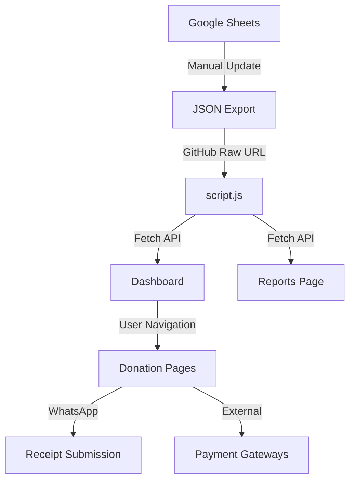
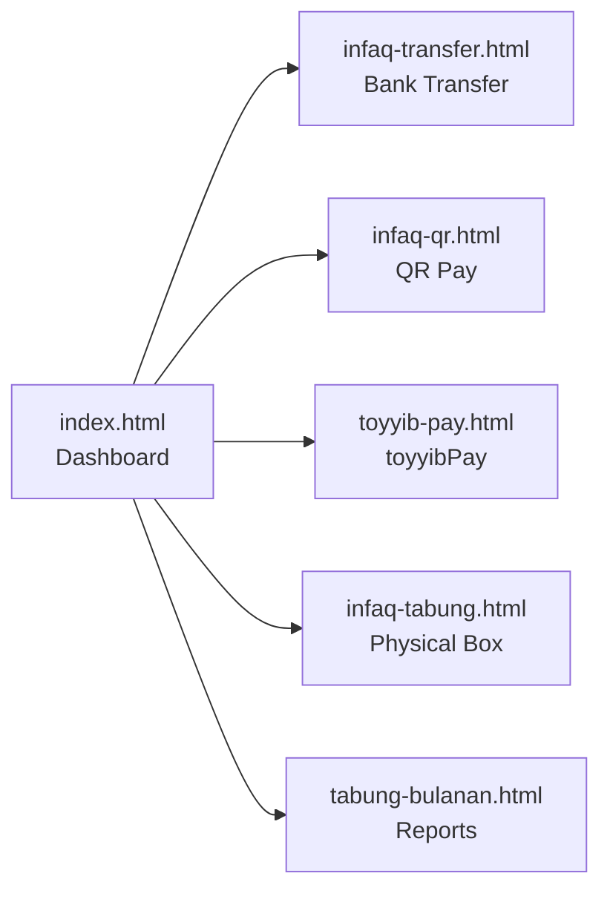

# 🛠️ MAMTJ6 Infaq Center - Developer Documentation

> Technical guide for developers and maintainers

---

## 📋 Table of Contents

- [Development Setup](#-development-setup)
- [Project Architecture](#-project-architecture)
- [File Structure](#-file-structure)
- [Design System](#-design-system)
- [Data Management](#-data-management)
- [Customization Guide](#-customization-guide)
- [Testing & Debugging](#-testing--debugging)
- [Deployment](#-deployment)
- [Code Standards](#-code-standards)
- [Future Enhancements](#-future-enhancements)

---

## 🚀 Development Setup

### Prerequisites

- **Web Browser**: Chrome, Firefox, Safari, or Edge (latest version)
- **Text Editor**: VS Code (recommended), Sublime Text, or any modern editor
- **Local Server** (optional): Python, Node.js, or VS Code Live Server extension
- **Git**: For version control

### Installation Steps

1. **Clone the Repository**
   ```bash
   git clone https://github.com/your-org/infaq-mamtj6.git
   cd infaq-mamtj6
   ```

2. **No Dependencies to Install!**
   - All dependencies are loaded via CDN
   - No `npm install` or build process required
   - Ready to run immediately

3. **Run Locally**

   **Option A: VS Code Live Server**
   - Install "Live Server" extension
   - Right-click `index.html` → "Open with Live Server"
   - Auto-reload on file changes

   **Option B: Python HTTP Server**
   ```bash
   # Python 3
   python -m http.server 8000
   
   # Python 2
   python -m SimpleHTTPServer 8000
   ```

   **Option C: Node.js**
   ```bash
   npx serve
   ```

   **Option D: Direct File Access**
   - Simply double-click `index.html`
   - Note: Some features may require a server (CORS)

4. **Access the Application**
   - Navigate to `http://localhost:8000`
   - Or the URL provided by your local server

---

## 🏗️ Project Architecture

### System Overview



### Data Flow

1. **Data Source**: Google Sheets (manually updated by administrators)
2. **Data Export**: Sheets exported to JSON format
3. **Data Hosting**: JSON hosted on GitHub (raw URL)
4. **Data Fetching**: JavaScript fetches JSON via API
5. **Data Display**: DOM manipulation to show statistics
6. **Auto-Refresh**: Data refreshes every 5 minutes

### Page Structure



---

## 📂 File Structure

### Core Files

| File | Purpose | Dependencies |
|------|---------|--------------|
| `index.html` | Main dashboard | Tailwind, Phosphor, script.js |
| `script.js` | Data fetching & DOM manipulation | None |
| `style.css` | Custom CSS (animations, utilities) | None |

### Donation Pages

| File | Method | Status |
|------|--------|--------|
| `infaq-transfer.html` | Bank Transfer | ✅ Complete |
| `infaq-qr.html` | QR Pay (DuitNow) | ✅ Complete |
| `toyyib-pay.html` | Online Payment | 🔄 UI Only |
| `infaq-tabung.html` | Physical Donation | ✅ Complete |

### Report Pages

| File | Purpose | Charts |
|------|---------|--------|
| `tabung-bulanan.html` | Monthly reports | Weekly + Monthly |

### Display Pages (Legacy/Future)

| File | Status |
|------|--------|
| `display/infaq-pembangunan.html` | 🔄 To be implemented |
| `display/tabung-bulanini.html` | 📦 Archive |
| `display/tabung-bulanlepas.html` | 📦 Archive |

---

## 🎨 Design System

### Color Palette

```css
/* Primary Colors */
--primary-blue: #3b82f6;      /* Main brand color */
--secondary-slate: #1e293b;   /* Dark accents */

/* Donation Method Colors */
--transfer-blue: #3b82f6;     /* Bank Transfer */
--qr-green: #10b981;          /* QR Pay */
--billplz-purple: #9333ea;    /* Billplz */
--tabung-orange: #f59e0b;     /* Physical Tabung */

/* Semantic Colors */
--success-green: #22c55e;
--warning-yellow: #eab308;
--error-red: #ef4444;
--info-blue: #3b82f6;

/* Neutral Palette */
--slate-50: #f8fafc;
--slate-100: #f1f5f9;
--slate-200: #e2e8f0;
--slate-500: #64748b;
--slate-800: #1e293b;
--slate-900: #0f172a;
```

### Typography

```css
/* Font Family */
font-family: 'Inter', sans-serif;  /* Loaded from Google Fonts */

/* Font Sizes */
--text-xs: 0.75rem;      /* 12px */
--text-sm: 0.875rem;     /* 14px */
--text-base: 1rem;       /* 16px */
--text-lg: 1.125rem;     /* 18px */
--text-xl: 1.25rem;      /* 20px */
--text-2xl: 1.5rem;      /* 24px */
--text-3xl: 1.875rem;    /* 30px */
--text-4xl: 2.25rem;     /* 36px */

/* Font Weights */
--font-normal: 400;
--font-medium: 500;
--font-semibold: 600;
--font-bold: 700;
```

### Responsive Breakpoints

```css
/* Tailwind CSS Breakpoints */
sm: 640px   /* Small devices */
md: 768px   /* Medium devices */
lg: 1024px  /* Large devices (split layout activates) */
xl: 1280px  /* Extra large */
2xl: 1536px /* 2X Extra large */
```

### Component Patterns

#### Card Component
```html
<div class="bg-white rounded-2xl shadow-sm border border-slate-200 p-6">
  <!-- Content -->
</div>
```

#### Button Primary
```html
<button class="bg-blue-600 hover:bg-blue-700 text-white font-bold py-3 px-6 rounded-xl shadow-lg transition">
  Click Me
</button>
```

#### Input Field
```html
<input type="text" 
  class="w-full px-4 py-3 bg-slate-50 border border-slate-200 rounded-xl focus:outline-none focus:ring-2 focus:ring-blue-500 focus:bg-white transition">
```

#### Toast Notification
```html
<div class="fixed bottom-8 left-1/2 transform -translate-x-1/2 bg-slate-900 text-white px-6 py-3 rounded-full shadow-2xl">
  <i class="ph-fill ph-check-circle text-green-400"></i>
  <span>Success!</span>
</div>
```

### Animation Classes

```css
/* Fade In Up */
.fade-in-up {
  animation: fadeInUp 0.5s ease-out forwards;
  opacity: 0;
  transform: translateY(20px);
}

@keyframes fadeInUp {
  to {
    opacity: 1;
    transform: translateY(0);
  }
}

/* Skeleton Loader */
.skeleton {
  background: linear-gradient(90deg, #f1f5f9 25%, #e2e8f0 50%, #f1f5f9 75%);
  background-size: 200% 100%;
  animation: shimmer 1.5s infinite;
}

@keyframes shimmer {
  0% { background-position: 200% 0; }
  100% { background-position: -200% 0; }
}
```

---

## 📊 Data Management

### JSON Data Source

**Current Setup:**
- Data stored in Google Sheets
- Manually exported to JSON
- Hosted on GitHub (raw URL)
- Fetched via JavaScript

**Data URL:**
```javascript
const jsonDataUrl = "https://raw.githubusercontent.com/multimedia-mamtj6/infaq/main/data/data.json";
```

### Data Structure

See [DATA_STRUCTURE.md](DATA_STRUCTURE.md) for complete schema documentation.

**Quick Reference:**
```json
{
  "projek": {
    "NamaProjek": "string",
    "SasaranKutipan": number,
    "JumlahTerkumpul": number,
    "Peratusan": number
  },
  "ringkasan": {
    "kutipan": {
      "bulanIni": { "bulan": "string", "jumlah": number },
      "bulanLepas": { "bulan": "string", "jumlah": number },
      "tahunIni": { "tahun": "string", "jumlah": number }
    }
  },
  "paparanBulanIni": {
    "Minggu1": number,
    "Minggu2": number,
    "Minggu3": number,
    "Minggu4": number,
    "Minggu5": number
  },
  "graf": {
    "2025": {
      "tahun": "2025",
      "labels": ["Jan", "Feb", ...],
      "data": [1000, 1500, ...]
    }
  },
  "tarikhKemaskini": "ISO 8601 date string"
}
```

### Updating Data

**Workflow:**
1. Update Google Sheets with new donation data
2. Export sheet as JSON
3. Upload JSON to GitHub repository
4. Website auto-fetches updated data (5-minute cache)

**Manual Refresh:**
- Users can refresh browser to force update
- Auto-refresh runs every 5 minutes

---

## 🔧 Customization Guide

### Adding a New Donation Method

1. **Create HTML Page**
   ```bash
   cp infaq-transfer.html infaq-newmethod.html
   ```

2. **Update Page Content**
   - Change page title
   - Update header text
   - Modify action card content
   - Adjust color scheme

3. **Add to Dashboard**
   ```html
   <!-- In index.html -->
   <a href="infaq-newmethod.html" class="...">
     <i class="ph ph-icon-name ..."></i>
     <span>New Method</span>
   </a>
   ```

4. **Update Navigation**
   - Ensure back button works
   - Update footer links

### Changing Bank Account Details

**File:** `infaq-transfer.html`

```html
<!-- Line 153-155 -->
<h2 id="account-number" class="...">
  1234 5678 9012  <!-- Change this -->
</h2>

<!-- Line 164 -->
<button onclick="copyToClipboard('123456789012')">  <!-- And this -->
```

### Modifying Colors

**Global Colors (Tailwind Config):**
```html
<!-- In each HTML file -->
<script>
  tailwind.config = {
    theme: {
      extend: {
        colors: {
          primary: '#3b82f6',    // Change primary color
          secondary: '#1e293b',  // Change secondary color
        }
      }
    }
  }
</script>
```

**Page-Specific Colors:**
- Transfer: Blue gradient (`from-blue-600 to-slate-900`)
- QR: Green gradient (`from-green-600 to-emerald-600`)
- Billplz: Purple gradient (`from-purple-600 to-blue-600`)
- Tabung: Orange accents

### Adding New Statistics

1. **Update JSON Structure**
   - Add new field to data source

2. **Update HTML**
   ```html
   <span id="new-stat" class="skeleton">Loading...</span>
   ```

3. **Update JavaScript**
   ```javascript
   // In script.js
   set('new-stat', data.newField);
   ```

---

## 🧪 Testing & Debugging

### Browser Compatibility

**Tested Browsers:**
- ✅ Chrome 90+
- ✅ Firefox 88+
- ✅ Safari 14+
- ✅ Edge 90+

**Known Issues:**
- None currently

### Responsive Testing Checklist

**Desktop (1920x1080):**
- [ ] Split layout renders correctly
- [ ] Max-width container prevents over-stretching
- [ ] All text readable
- [ ] Images/icons display properly
- [ ] Hover states work

**Tablet (768x1024):**
- [ ] Layout adapts appropriately
- [ ] Touch targets are adequate
- [ ] No horizontal scrolling

**Mobile (375x667):**
- [ ] Single-column stack
- [ ] Action card appears first
- [ ] All buttons touch-friendly (min 44px)
- [ ] Text readable without zooming
- [ ] Forms fully functional

### Common Issues & Solutions

**Issue: Data not loading**
```javascript
// Check browser console for errors
// Verify JSON URL is accessible
// Check CORS policy
// Ensure JSON is valid (use JSONLint)
```

**Issue: Skeleton loaders not disappearing**
```javascript
// Check if stopLoading() is called
// Verify data fetch is successful
// Check element IDs match
```

**Issue: Copy to clipboard not working**
```javascript
// Ensure HTTPS or localhost
// Check browser permissions
// Verify navigator.clipboard API support
```

**Issue: Charts not rendering**
```javascript
// Ensure Chart.js is loaded
// Check canvas element exists
// Verify data format is correct
// Check console for errors
```

### Debugging Tips

1. **Use Browser DevTools**
   - Console: Check for JavaScript errors
   - Network: Verify data fetching
   - Elements: Inspect DOM structure
   - Application: Check localStorage/cache

2. **Enable Verbose Logging**
   ```javascript
   // Add to script.js
   console.log('Data fetched:', data);
   console.log('Element found:', element);
   ```

3. **Test Data Locally**
   ```javascript
   // Replace remote URL with local file
   const jsonDataUrl = "./data/test-data.json";
   ```

---

## 🚀 Deployment

### Hosting Options

#### Option 1: GitHub Pages (Recommended)

**Pros:**
- Free hosting
- Automatic HTTPS
- Easy deployment
- Version control

**Steps:**
1. Push code to GitHub repository
2. Go to Settings → Pages
3. Select branch (main/master)
4. Save and wait for deployment
5. Access via `https://username.github.io/repo-name`

#### Option 2: Netlify

**Pros:**
- Free tier available
- Continuous deployment
- Custom domains
- Form handling

**Steps:**
1. Connect GitHub repository
2. Configure build settings (none needed)
3. Deploy
4. Access via provided URL

#### Option 3: Vercel

**Pros:**
- Fast global CDN
- Automatic HTTPS
- Preview deployments

**Steps:**
1. Import GitHub repository
2. Deploy (zero configuration)
3. Access via provided URL

#### Option 4: Traditional Web Hosting

**Requirements:**
- FTP access
- Web server (Apache/Nginx)

**Steps:**
1. Upload all files via FTP
2. Ensure directory permissions
3. Access via domain

### Environment Configuration

**No environment variables needed!**
- All configuration is in-code
- CDN dependencies (no local files)
- JSON URL is hardcoded

**To Change Data Source:**
```javascript
// In script.js, line 1
const jsonDataUrl = "YOUR_NEW_URL_HERE";
```

### Pre-Deployment Checklist

- [ ] Test all pages locally
- [ ] Verify data fetching works
- [ ] Check all links are relative (not absolute)
- [ ] Ensure images load correctly
- [ ] Test on multiple browsers
- [ ] Test on mobile devices
- [ ] Verify WhatsApp links work
- [ ] Check Google Maps embed
- [ ] Update contact information
- [ ] Update bank account details (if needed)

---

## 📝 Code Standards

### HTML Conventions

- Use semantic HTML5 elements
- Indent with 4 spaces
- Use lowercase for tags and attributes
- Add comments for major sections
- Use meaningful IDs and classes

**Example:**
```html
<!-- MAIN CONTENT -->
<main class="container">
  <!-- Dashboard Section -->
  <section id="dashboard">
    <h1 class="title">Dashboard</h1>
  </section>
</main>
```

### CSS Conventions

- Use Tailwind utility classes first
- Custom CSS in `style.css` for animations
- Follow BEM naming for custom classes
- Group related utilities

**Example:**
```html
<!-- Good: Grouped utilities -->
<div class="flex items-center gap-4 p-6 bg-white rounded-xl">

<!-- Avoid: Scattered utilities -->
<div class="flex p-6 items-center bg-white gap-4 rounded-xl">
```

### JavaScript Conventions

- Use ES6+ syntax
- Prefer `const` over `let`
- Use arrow functions
- Add JSDoc comments for functions
- Handle errors gracefully

**Example:**
```javascript
/**
 * Formats a number as Malaysian Ringgit currency
 * @param {number} amount - The amount to format
 * @returns {string} Formatted currency string
 */
function formatCurrency(amount) {
  if (typeof amount !== 'number') return "RM 0.00";
  return `RM ${amount.toLocaleString('en-MY', { 
    minimumFractionDigits: 2, 
    maximumFractionDigits: 2 
  })}`;
}
```

### File Naming Conventions

- Use lowercase with hyphens: `infaq-transfer.html`
- Be descriptive: `tabung-bulanan.html` not `report.html`
- Consistent prefixes: `infaq-*.html` for donation pages

---

## 🔮 Future Enhancements

### Version 3.0 Roadmap

#### 1. Billplz Payment Integration
**Status:** 🔄 In Planning

**Requirements:**
- Billplz API credentials
- Backend server for payment processing
- Webhook handling
- Receipt generation

**Implementation:**
```javascript
// Pseudo-code
async function processBillplzPayment(amount, userDetails) {
  const response = await fetch('/api/billplz/create', {
    method: 'POST',
    body: JSON.stringify({ amount, ...userDetails })
  });
  const { url } = await response.json();
  window.location.href = url;
}
```

#### 2. Project Details Page
**Status:** 🔄 To Be Implemented

**File:** `display/infaq-pembangunan.html`

**Features:**
- Detailed project information
- Photo gallery
- Timeline/milestones
- Budget breakdown

#### 3. Donor Leaderboard
**Status:** 💡 Idea Stage

**Features:**
- Top donors (anonymous or named)
- Monthly rankings
- Badges/achievements
- Gamification elements

#### 4. Email Notifications
**Status:** 💡 Idea Stage

**Requirements:**
- Email service (SendGrid, Mailgun)
- Backend integration
- Email templates

**Use Cases:**
- Receipt confirmation
- Monthly reports
- Project updates

#### 5. Multi-Language Toggle
**Status:** 💡 Idea Stage

**Implementation:**
```javascript
// Language switcher
const translations = {
  en: { title: "Donation Center" },
  ms: { title: "Pusat Infaq" }
};

function switchLanguage(lang) {
  document.querySelectorAll('[data-i18n]').forEach(el => {
    const key = el.dataset.i18n;
    el.textContent = translations[lang][key];
  });
}
```

#### 6. Dark Mode
**Status:** 💡 Idea Stage

**Implementation:**
```javascript
// Dark mode toggle
function toggleDarkMode() {
  document.documentElement.classList.toggle('dark');
  localStorage.setItem('darkMode', 
    document.documentElement.classList.contains('dark')
  );
}
```

### Technical Debt

- [ ] Add unit tests (Jest)
- [ ] Implement service worker for offline support
- [ ] Add error boundary for better error handling
- [ ] Optimize images (WebP format)
- [ ] Add loading states for all async operations
- [ ] Implement proper state management
- [ ] Add accessibility improvements (ARIA labels)

---

## 📞 Developer Support

**Questions or Issues?**
- 📧 Email: dev@mamtj6.com
- 💬 GitHub Issues: [Create an issue](https://github.com/your-org/infaq-mamtj6/issues)
- 📚 Documentation: [Full docs](README.md)

---

<div align="center">

**Happy Coding! 💻**

*May your code be bug-free and your commits meaningful* 🚀

[🏠 Back to README](README.md) • [👥 User Guide](USER_GUIDE.md) • [📊 Data Guide](DATA_STRUCTURE.md)

</div>
